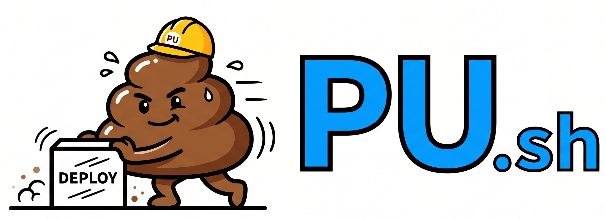

<p align="center">
  
</p>

<p align="center"><strong>A full coding agent in 310 lines of shell. Pronounced exactly how you think.</strong></p>

<p align="center"><em>Finally, a slop cannon small enough to fit in your pocket.</em></p>

```sh
curl -sL https://raw.githubusercontent.com/NahimNasser/pu/main/pu.sh -o pu.sh && chmod +x pu.sh
./pu.sh "refactor auth.py to use JWT"
```

That's the entire install. No npm. No pip. No docker. No runtime. 19KB of shell, a `curl` binary, and an API key.

## What

```sh
# Zero install. Literally.
curl -sL https://raw.githubusercontent.com/NahimNasser/pu/main/pu.sh > pu.sh && chmod +x pu.sh

# Push some code
./pu.sh "refactor auth.py to use JWT"

# Interactive (multi-turn, remembers everything)
./pu.sh
> write a REST API server in Go
> now add rate limiting
> write tests for it

# Pipe agents together because we're adults
./pu.sh "write the code" | ./pu.sh --pipe "review it for security bugs"

# OpenAI works too
AGENT_PROVIDER=openai AGENT_MODEL=gpt-4o ./pu.sh "your task"
```

## Why

We ran [30+ experiments](final_report.md) to answer a question: *what's the most portable agentic harness that can run anywhere?*

The answer is a shell script. The agent loop itself — send prompt, parse response, execute tool, append to history, repeat — is about 90 lines. Everything else is developer experience.

**Here's the thing nobody tells you:** the `node_modules` folder of a typical coding agent weighs more than the entire Doom source code. Three times over. `pu.sh` weighs less than most README files.

## Features

| What | How |
|---|---|
| **7 tools** | `bash` `read` `write` `edit` `grep` `find` `ls` — same as Pi |
| **Interactive REPL** | Multi-turn with memory. `/model` `/copy` `/export` `/skill:name` |
| **File editing** | Surgical `oldText` → `newText` replacement (not file rewrite) |
| **Context files** | Auto-loads `AGENTS.md` / `CLAUDE.md` from cwd up to `/` |
| **Context size cap** | `AGENT_CONTEXT_LIMIT` env var (logs when exceeded — full trim not yet implemented) |
| **Thinking levels** | `AGENT_THINKING=high` for reasoning-heavy tasks |
| **Skills** | `/skill:name` loads `SKILL.md` capability packages |
| **Prompt templates** | `/template` expands from `.pi/prompts/*.md` |
| **@file references** | `@src/main.py` inlines file contents into your prompt |
| **!command** | `!ls -la` runs bash inline from the REPL |
| **Session export** | `/export` dumps conversation as markdown |
| **Session forking** | `/fork` branches your session |
| **Token tracking** | `--cost` shows input/output token counts |
| **Pipe mode** | `--pipe` for clean output, composable with other agents |
| **Checkpoint/resume** | `AGENT_HISTORY=file.json` saves and restores state |
| **Confirmation mode** | `AGENT_CONFIRM=1` asks before every tool execution |
| **Dual provider** | Anthropic + OpenAI (via `AGENT_PROVIDER` env var; model switchable mid-session via `/model`) |
| **JSONL logging** | Every step logged as structured JSON |

## What it can't do

Let's be honest. The remaining 26% of Pi's features need a real runtime:

- No TUI (it's a shell script, not a lifestyle)
- No image input (base64 in shell is a war crime we chose not to commit)
- No streaming (curl waits for the full response like a patient person)
- No OAuth (if you need a browser popup from a shell script, reconsider your life)
- No Windows (PowerShell people, I'm sorry, but also I'm not sorry)
- No keyboard shortcuts (it's `read -r`, not Vim)
- No themes (your terminal theme IS the theme)
- No package manager (it's one file. `cp` is the package manager)

Look, every other coding agent is a 200MB slop cannon with 1,847 npm dependencies, a webpack config, and a mass-produced hallucination pipeline. `pu.sh` is the same slop cannon but it's 310 lines and you can read every single one of them. You'll know exactly where the slop is coming from. That's not a bug, that's transparency.

All 10 missing features trace back to one thing shell can't do: **raw terminal mode**. That's it. One `termios` call away from 100%.

## The Size

```
pu.sh                19 KB    █  (sh + curl — already on every Unix box)
Claude Code         209 MB    ██████████████████████████  (self-contained native binary)
Goose CLI           237 MB    █████████████████████████████  (self-contained Rust binary)
Pi + Node           281 MB    ███████████████████████████████████  (172 MB pkg + 108 MB Node 23)
SWE-agent (Docker)  1.8 GB    ██████████████████████████████████████████████████████████████...  (uncompressed image)
```

*All numbers measured on this machine (macOS arm64, Node 23.11.0), not pulled from release pages:*
- *pu.sh: `wc -c` on the file.*
- *Claude Code: `npm install @anthropic-ai/claude-code` + `du -sh node_modules`. Ships an `optionalDependency` that fetches a 208 MB native Mach-O binary; doesn't need Node to run after install.*
- *Goose: extracted `goose-aarch64-apple-darwin.tar.bz2` from the latest release (tarball is 65 MB, binary inside is 237 MB — ~3.5× compression).*
- *Pi: `du -sh` on `node_modules/@mariozechner/pi-coding-agent` + size of the `node` binary it runs under. 132 deps bundled.*
- *SWE-agent: `docker image inspect sweagent/swe-agent:latest --format '{{.Size}}'` → 1.78 GB uncompressed.*

Roughly **~15,000× smaller** than Pi, **~13,000×** smaller than Goose, **~11,000×** smaller than Claude Code, **~100,000×** smaller than SWE-agent. Same 7 tools. Same system prompt structure. Same `AGENTS.md` loading. Same `oldText`/`newText` editing.

Our entire supply chain attack surface is `curl`. We wrote our own JSON parser in `awk` because jq was one dependency too many. Your average coding agent has more transitive dependencies than a European royal family tree — and about the same chance of something inbred causing a security incident.

## Configuration

All env vars. Zero config files. Because config files are where joy goes to die.

| Variable | Default | What |
|---|---|---|
| `AGENT_MODEL` | `claude-sonnet-4-20250514` | Model |
| `AGENT_PROVIDER` | `anthropic` | `anthropic` or `openai` |
| `AGENT_MAX_STEPS` | `25` | Safety limit on agent loops |
| `AGENT_MAX_TOKENS` | `4096` | Max tokens per response |
| `AGENT_THINKING` | (off) | `off` `low` `medium` `high` |
| `AGENT_CONFIRM` | `0` | `1` = ask before each tool call |
| `AGENT_LOG` | `agent.jsonl` | Structured log file |
| `AGENT_HISTORY` | (none) | Checkpoint file for resume |
| `AGENT_SYSTEM` | (built-in) | Custom system prompt |
| `AGENT_CONTEXT_LIMIT` | `100000` | Context window chars |

## How it works

```
┌─────────────────────────────────────────┐
│  You type a thing                       │
│  ↓                                      │
│  curl sends it to Claude/GPT            │
│  ↓                                      │
│  Model says "use the write tool"        │
│  ↓                                      │
│  Shell writes the file                  │
│  ↓                                      │
│  Result goes back to model              │
│  ↓                                      │
│  Model says "done"                      │
│  ↓                                      │
│  You have a file                        │
│                                         │
│  That's it. That's the agent.           │
└─────────────────────────────────────────┘
```

310 lines. 7 tools. 2 providers. 1 file. 0 dependencies beyond `sh` + `curl`.

The JSON parser is 30 lines of `awk`. No jq. No python. No node. Just POSIX.

## Testing

```sh
# Run all 50 unit tests (no API calls, no cost)
bash eval/run_eval.sh

# Run the 45-capability Pi parity comparison
bash eval/test_coverage.sh

# Run live API tests (requires ANTHROPIC_API_KEY)
bash eval/run_eval.sh live
```

**What the tests cover:**
- **Portability** (6) — single file, size, shebang, syntax, deps, help
- **Tool execution** (8) — JSON escaping, command exec, stderr, exit codes, truncation
- **JSON parsing** (11) — Anthropic tool_use/text, OpenAI tool_calls/text, nested fields, multiline content, error responses, malformed input, key disambiguation
- **Conversation** (5) — message construction, multi-turn, checkpoint save/load, context windowing
- **Resilience** (5) — missing API key, empty task, bad provider, retry logic, max steps
- **Observability** (5) — JSONL logging, valid JSON, field structure, cost tracking, verbose
- **Composability** (5) — stdin, pipe mode, shebang, config-free, curl-pipe deploy
- **Extensibility** (5) — system prompt, multi-provider, model config, max tokens, confirmation

## The bugs we found so you don't have to

1. **`set -e` is a serial killer.** `[ -f file ] && do_thing` returns exit code 1 when the file doesn't exist. `set -e` interprets this as a fatal error and silently kills your script. No message. No stack trace. Just death. We removed `set -e` and the entire agent started working. ([experiment 29](final_report.md))

2. **macOS sed ≠ GNU sed.** The `:a;N;$!ba` multiline pattern that every Stack Overflow answer uses doesn't work on macOS. We replaced it with `awk` because `awk` works everywhere and doesn't gaslight you.

3. **jq was a dependency.** We wrote 30 lines of awk to parse JSON rather than require `brew install jq`. The awk parser handles nested objects, escaped quotes, multiline strings, and key disambiguation (`"type":"function"` vs `"function":{}`). One fewer install step is one fewer reason someone closes the tab.

4. **Heredocs don't survive JSON.** When the model returns `cat > file << 'EOF'`, the heredoc body gets mangled by JSON escaping. Solution: tell the model to use the `write` tool instead. System prompt engineering > parsing heroics.

## Prior art & credits

`pu.sh` is a derived work, and we want to be loud about it. The system prompt structure, the 7-tool surface (`bash` `read` `write` `edit` `grep` `find` `ls`), the `oldText`/`newText` editing model, and the `AGENTS.md` loading convention all come straight from **[Pi](https://pi.dev/)**. Huge thanks and respect to the Pi team — they figured out the right shape of a small, honest coding agent, and we just rewrote the runtime in shell. If you want a real, extensible, production-grade agent built by people who clearly know what they're doing, go use Pi. They earned it.

We [compared against Pi](eval/COMPARISON.md) feature-by-feature. Pi wins on extensibility (TypeScript plugins, TUI, 20+ providers). We win on portability (curl it onto a Raspberry Pi in 1 second). Different tools for different problems.

## FAQ

**Is this production-ready?**
It's called `pu.sh`. It's a 19KB slop cannon that talks to Claude via `curl`. You tell me.

**Should I use this instead of Pi/Claude Code/Cursor?**
For daily coding, no. Use a real tool. Those are industrial-grade slop cannons with proper aiming mechanisms. This is more of a slop pistol. For CI/CD, containers, edge, quick scripts, or understanding how agents actually work — `./pu.sh` and see what happens.

**How do I pronounce it?**
However makes your coworkers the most uncomfortable.

**Did you really name a coding agent after feces?**
It's `pu.sh`. As in push. As in `./pu.sh "deploy to prod"`. The fact that it sounds like something else is entirely coincidental and we are very serious engineers.

**Did an AI write this?**
An AI and a human ran 30+ experiments over a multi-hour session, arguing about `set -e`, debating whether `awk` is portable, and discovering that the meaning of life is a valid integration test. The shell script was co-written. The bugs were all shell's fault.

## License

MIT — see [LICENSE](LICENSE). It's 310 lines. Go nuts.
